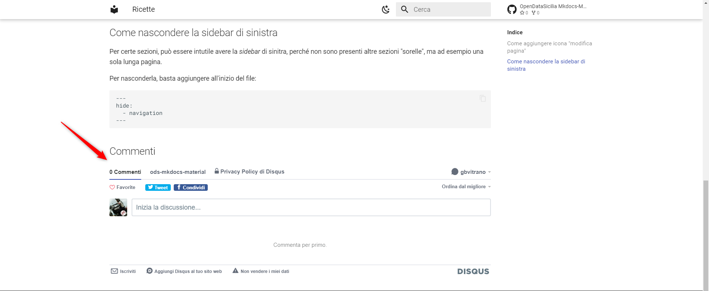

---
hide:
  - navigation
---

## Come aggiungere icona "modifica pagina"

È possibile aggiungere un'icona che - in dipendenza dei permessi che si hanno sul repo - consente o di fare una modifica diretta sui contenuti della pagina o di proporne una (vedi immagine sotto).


Per farlo bisogna aprire il file di configurazione presente nella radice del *repository*, ovvero `mkdocs.yml`, e aggiungere l'URL del *repository* e l'URL di modifica.<br>
Quest'ultimo in un repository standard è `edit/main/docs/` (`main` è il nome standard del *branch* su GitHub).

```yaml
repo_url: https://github.com/opendatasicilia/ods-mkdocs-material
edit_uri: edit/main/docs/
```


## Come nascondere la sidebar di sinistra

Per certe sezioni, può essere intutile avere la *sidebar* di sinitra, perché non sono presenti altre sezioni "sorelle", ma ad esempio una sola lunga pagina.

Per nasconderla, basta aggiungere all'inizio del file:

```
---
hide:
  - navigation
---
```
## Come abilitare e/o disabilitare i commenti Disqus

È possibile abilitare i commenti di Disqus su tutte le pagine del sito ad eccezione della homepage



Per prima cosa dobbiamo verificare se nel `mkdocs.yml` sia impostato correttamente il `site_url`, solitamente troviamo il `site_url` nella sezione *Project information*

Esempio di blocco Project information:

```yaml
## Project information
site_name: OpenDataSicilia Mkdocs-Material
site_url: https://opendatasicilia.github.io/ods-mkdocs-material/
site_description: OpenDataSicilia Mkdocs-Material repo demo
```

Per abilitare i commenti di Disqus bisogna aprire il file di configurazione presente nella radice del *repository*, ovvero `mkdocs.yml`, e aggiungere nella sezione *extra:* il seguente codice:

```yaml
extra:
  disqus: <shortname>
```

Esempio:

```yaml
extra:
   disqus: ods-mkdocs-material
```
Cosa è uno *shortname*?
Uno *shortname* è l'identificatore univoco assegnato a un sito Disqus. Tutti i commenti pubblicati su un sito sono referenziati con il nome breve. Segui la [guida di Disqus](https://help.disqus.com/en/articles/1717111-what-s-a-shortname) per assegare al tuo sito uno *[shortname](https://help.disqus.com/en/articles/1717111-what-s-a-shortname)*


Per alcune pagine può essere utile disabilitare commenti, per farlo basta aggiungere all'inizio del file:

```
---
disqus: ""
---
```